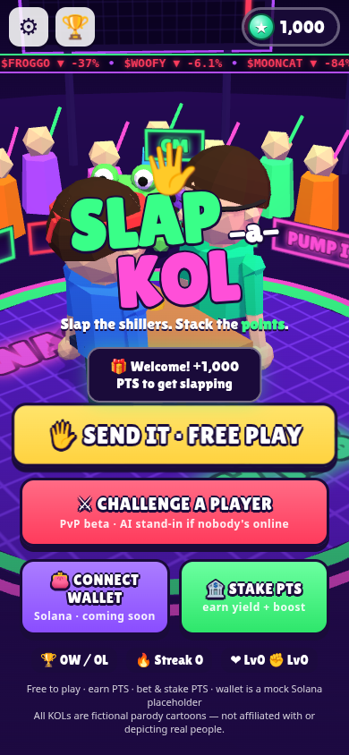

# 🖐 Smack-a-KOL

A hyper-casual, degen-memecoin-themed **slap-fighting browser game** prototype.
Create your fighter, pick a (parody) crypto KOL, time your slap on the power meter, and send them flying.
**Points only for now.** The wallet is a mock Solana placeholder.



## Run it

You don't need a build step. It's plain static HTML/CSS/JS, and Three.js r158 is vendored in `vendor/`.

| Option | Command |
|---|---|
| Just open it | double-click **`index.html`** (works from `file://`, offline) |
| Local server | `npm start` → http://localhost:5173 (uses `npx serve`) |
| Share on your LAN (friends soft launch) | `npm run lan` → `http://<your-ip>:5173` |
| Zip to send to friends | `npm run zip` → `dist/smack-a-kol.zip` (unzip → open `index.html`) |
| Any static host later | upload the folder as-is (Netlify drop, Vercel, GitHub Pages, S3…) |

Controls: **tap / click** (or **Space / Enter / A / L**) to lock **your** meter. Keys **F / H / R** = Golden Fist / Helmet / Degen Rage.

Haptics use the Vibration API (Android Chrome; iPhone Safari does not support web vibration).

## How to play

1. **Create an account + fighter** (first launch; edit any time from the fighter chip on the menu): pick a player name (2–16 chars), then build your low-poly fighter with a live 3D preview (drag to spin): body preset, hair style + colour, skin tone, eye style + colour, outfit colour, accessory, catchphrase, or hit 🎲 RANDOM. Accounts are local only (no backend). You show up on the LEFT in every fight, in the HUD portrait, on the leaderboard and on the results screen.
   - Saved as a versioned profile in the save blob: `{ v: 2, id, name, createdAt, phrase, avatar: { body, hairStyle, hairColor, skin, eyes, eyeColor, accessory, shirt } }`. Old `{ name, colour, phrase }` fighters are migrated automatically.
   - `SAK.Scene3D.applyAvatar(model, params)` is the single function that turns avatar params into the 3D model (arena + creator preview). `SAK.Account.toLook()` feeds the SVG portraits.
   - **Upload PFP → AI fighter** is a disabled "coming soon" button. Later, an AI that reads a PFP only has to return the `avatar` params (`SAK.Account.fromPfp` stub).
2. **SEND IT (free play)** or **⚔ Challenge a player**: pick a mode, optionally bet PTS.
3. **Private meter (per device)**: you only see **your** needle this round.
   - Role label: **🥊 ATTACK** or **🛡 BRACE** (roles alternate each round).
   - Both roles use the **jerky / unpredictable** needle — same green ★ fairness.
   - Opponent locks **privately** (you never see their needle while you play).
4. **After both lock**: the meter panel swaps **inline** (same spot, no popup) into a compact reveal — YOU vs THEM needles on one dial, degrees off the green ★ centre, and the round result. Tap it (or Space/Enter) to continue, or it auto-continues after ~2.2 s.
5. **Closer to the centre of the green zone wins the round**. Equal distance → **attacker wins** (tie-break).
   - **Role camera**: while YOU **brace** (about to get slapped) the camera orbits onto **your face**; while you **attack** it returns to the default fight view. Smooth swing on every role change.
   - **Slap face-cam**: the camera orbits onto the slapped fighter's FACE for the hit reaction (shallower swing on a stuffed slap), holds a beat, then eases back to the fight view for the next round.
6. Match ends when someone hits the wins-needed score. KO fly-off (camera tracks the loser through flight + landing) + PTS result screen.

### Modes
- **⚡ Quick Duel**: **best of 3** (first to 2). Pays ½ PTS.
- **🥊 Classic KO**: **best of 5** (first to 3) — same private-meter rules.

### Soft-launch PvP
- UX is **my phone only** — one full-width private meter.
- **Quick Match / online list**: falls back to an **AI stand-in** that locks privately (same scoring rules). Live networked PvP can plug in later without changing the private-meter UX.

### Economy (all in-game PTS)
- **Free to play / play-to-earn**: every match pays PTS. A win pays the KOL's `winPts` plus perfect and streak bonuses. A loss still pays participation plus rounds won.
- **Optional bet**: wager PTS before a fight. If you win you get `bet × KOL payout` (x1.6 to x3.0) plus bonuses. If you lose, the bet is gone.
- **Stake Vault 🏦**: lock PTS to earn APR yield (demo-accelerated: 1 real minute ≈ 1 day). Staking also unlocks a **boost tier** (Bronze +10% … Diamond +100%), which multiplies match PTS and bet payouts.
- **Shop v1 = HEALTH + POWER** permanent upgrades. These buttons sit on the pre-fight screen and are paid in PTS. Costs scale ×1.55 per level, up to level 10.
- **Power-ups** (limited use, max one of each per fight, bought with PTS when you have none):
  🔥 **Golden Fist** (next landed slap x2.5 and never grades as a whiff; stays armed if your attack gets braced, refunded if unused at match end; 1 free per day) ·
  ⛑ **Helmet** (next 2 slaps that land on you −50%) ·
  😤 **Degen Rage** (your next 3 attack rounds: +40% dmg, but your meter needle is 25% faster).
- HP bars show rounds you can still lose before KO (the round loser's bar drops).
- New players get a 1,000 PTS welcome bonus. A "broke bonus" button shows up if you hit 0, so you can never get stuck.

### Roster & community
- **8 built-in parody KOLs** live in **`js/roster.js`**, a plain data array you can rename, add to or remove from with no other code changes.
  All of them are fictional cartoons with altered names and invented handles. They aren't affiliated with or depictions of real people.
- **Submit a KOL** (in the picker): name, colour, catchphrase. Look and stats are generated from the name. Submissions are stored in localStorage.
  You get 1 slot free, and more unlock at 500 / 1.5K / 3K / 6K lifetime PTS. There is basic validation: length limits, a tiny blocklist, and no links or @handles.
- **PvP lobby (stub)**: lists fake online players. "Slap" or Quick Match shows a *finding opponent…* radar, then falls back to an **AI stand-in**. Wagers are PTS.
- **Leaderboard 🏆**: a *Global* board (local, seeded fake degens plus you, ranked by lifetime PTS) and a *Friends* stub with a copy-invite-link button.

## What's mocked vs real

| Real (works now) | Mocked / stubbed |
|---|---|
| 3D fight, private meter, round scoring, KO physics, coin rain | Wallet connect (fake base58 address, no keys) |
| PTS economy, bets, staking yield and tiers, upgrades, power-ups | Online PvP matchmaking (AI stand-in fallback) |
| Private per-device meter UX (Bo3/Bo5) | Live networked PvP |
| localStorage persistence (key `slapakol.save.v1`) | Leaderboards (local + simulated players) |
| User-submitted KOLs + player fighter | Moderation (client-side blocklist only) |
| WebAudio synth SFX, haptics (mobile) | Pump/dump ticker and chart billboards (random) |

To reset everything, use ⚙ → Reset progress (or clear localStorage).

## Code map

```
index.html          screens + modals (menu, picker, fight HUD, result, vault, PvP, leaderboard, submit, account/creator)
css/style.css       mobile-first portrait UI (centred phone column on desktop)
vendor/three.min.js Three.js r158 classic build (no CDN needed)
js/config.js        ALL tunables: economy, meter zones, modes, power-ups, staking tiers, copy pools, UGC rules
js/roster.js        KOL roster data array  ← edit names here
js/storage.js       versioned localStorage save
js/account.js       local accounts: profile schema, avatar options/presets, migration, name rules
js/wallet.js        MOCK Solana wallet adapter (identity only)
js/economy.js       SAK.Points (PTS ledger) + SAK.Vault (staking)
js/matchmaking.js   PvP stub → AI stand-in
js/leaderboard.js   local global board + friends stub
js/audio.js         WebAudio synth SFX
js/avatars.js       procedural SVG portraits
js/scene3d.js       Three.js arena, low-poly fighters, slap/KO animations, crypto props
js/meter.js         semicircle SVG power meter (jerky for ATTACK + BRACE)
js/game.js          game controller / private-meter challenge state machine / UI wiring
```

### Private-meter challenge rules (locked)
- Each device shows only the local player's meter (ATTACK or BRACE).
- Shared green-centre fairness: same zone geometry for both roles.
- Both roles: random jerky speed / direction changes (`SAK.CHALLENGE` in `config.js`).
- Opponent lock is private until both lock — then the meter panel turns into an inline reveal comparing YOU vs THEM needles vs green ★.
- Score each exchange by `|needleAngle|` distance from centre — **closer wins**.
- **Tie-break: attacker wins** when distances are equal.
- Quick Duel = Bo3 · Classic = Bo5.


There's a debug hook in the browser console: `SAK_DEBUG.startFight('kobee', 250, 'duel')`, `SAK_DEBUG.state`, `SAK_DEBUG.openVault()`.

## Where Solana / a token plugs in later

The UI only talks to small interfaces, so going on-chain means swapping implementations, not rewriting the game:

1. **Wallet**: `js/wallet.js` → implement `connect()` with Phantom / Wallet Standard
   (`window.phantom.solana.connect()`, `publicKey.toBase58()`), and add `signMessage` for login.
   `SAK.SOLANA` in `config.js` holds placeholders (`cluster`, `tokenMint`, `vaultProgramId`).
2. **Currency**: `SAK.Points` in `js/economy.js` is the single ledger (`add / spend / canAfford`).
   Back it with a server-side balance first (anti-cheat). Later, add an SPL token and a claim/convert flow (PTS → token) rather than spending the token directly in-game.
3. **Bets / wagers**: they're currently escrowed in `startFight()` (`P.spend(bet)`) and paid in `endFight()`.
   On-chain, these become escrow program instructions, settled by a server that validates the slap timings.
4. **Staking**: `SAK.Vault` (`stake / unstake / claim / tier / boost`) maps 1:1 onto a staking program's instructions plus account reads.
5. **PvP / leaderboards**: `SAK.Matchmaking` and `SAK.Leaderboard` are where you'd plug in a realtime backend (Supabase / WebSocket / Colyseus).
   The server should own the RNG and the meter timing so scores and wagers can't be spoofed.

> Note: real-money wagering on games of skill or chance is regulated in many places. Get legal review before attaching real value to bets.

## Known gaps

- Online PvP is still simulated (AI stand-in locks privately; leaderboards are local).
- No real moderation of user-submitted KOLs (client-side only).
- Saves are per-browser (localStorage), and nothing syncs between devices.
- 3D is tuned for phones and laptops. Very old devices may need a lower pixel ratio (`renderer.setPixelRatio` in `scene3d.js`).
- English only.
